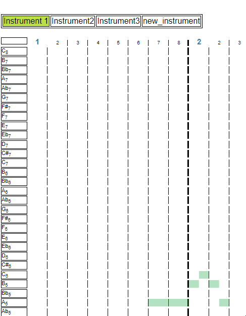
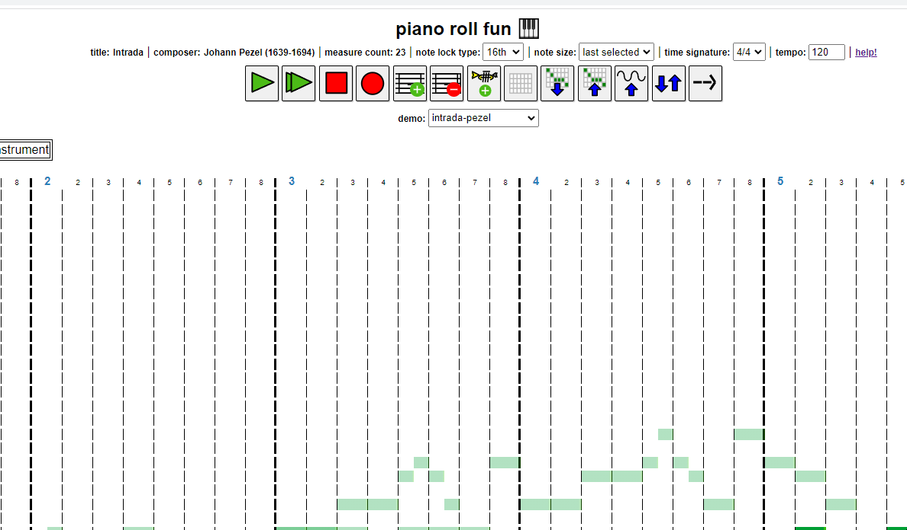

# piano_roll_browser    
a music sequencer inspired by LMMS, one of the best software applications ever!    
also influenced a bit by PxTone Collage, another great application!    
    
**It is highly recommended that Chrome be used for optimal functionality (except for recording) at the moment. Additionally, please note that this application is not intended to be used on mobile devices.**    
    
    
    
### cool features:    
- savable projects (as .json)    
- can click-and-drag to move and resize notes (down to as small as 32nd notes)   
- each note is customizable    
- togglable onion skin    
- recordable    
    
### instructions:    
- To change the name of the piece or the composer, double-click on 'title' or 'composer', just above the buttons.     
    
- Right-click an instrument block to change the sound, its default volume or toggle its notes' visibility when switching to another instrument.    
    
- Left-click a block on the grid to place a note; right-click to open a context menu to delete or use the middle mouse button. Stretch or shorten notes by grabbing the right side of a note and dragging. Notes can also be moved. Form chords by placing multiple notes in a column.    
    
- change the note lock size to adjust the range of note sizes and positions.    
    
- start playback at any column by clicking on any column header.    
    
**Instrument context-menu on right-click:**    
   
    
**Note context-menu on right-click:**    
   
    
**Resizing notes:**    
    
    
**Changing note lock size:**    
    
    
**setting play marker:**    
    
    
**toggling sticky toolbar:**    
    
    
I've also implemented a rudimentary custom instrument preset import ability (use this to create a custom instrument preset: https://github.com/syncopika/soundmaker). You can see some basic example presets in /example_presets, which are imported automatically in my demo.    
    
Disclaimer: the custom instrument functionality is currently pretty limited; there are lots of possible custom preset configurations that will break under my current implementation. So this feature is definitely a work-in-progress but you can maybe at least see its future potential! :)    
    
### current issues:        
- (Chrome) downloading the audio isn't great - the audio comes out fine but the duration is messed up (see: https://stackoverflow.com/questions/38443084/how-can-i-add-predefined-length-to-audio-recorded-from-mediarecorder-in-chrome).    
    
### current next steps?:    
- refactoring + tests    
    
### features I would like to implement:    
- be able to repeat a section    
- looping
    
### implementation / design:    
The objective of my piano roll is to arrange a number of notes with varying lengths and pitches with the help of a grid, put these notes in an array and then create audio nodes for each note so that a musical phrase can be played back.    
    
An important point about audio nodes: one limitation is that the performance of what the Web Audio API has to offer is based on the user's computer CPU. Depending on the computer, the creation of new, separate audio nodes per musical note can cause considerable lag and render an application useless (this number can get very large especially because some instruments involve multiple nodes per note).    
    
To optimize things a bit, instead of allowing new nodes to be created for each note, I calculate the minimum number of nodes needed for each instrument based on the maximum number of notes playing at the same time for that instrument. This strategy appears to work pretty well and improved performance considerably on my laptop (HP Notebook 15-ay011nr). Check out some of my hand-drawn diagrams in `/notes` for visual representations of my idea. Another possible performance enhancement might be the way I'm scheduling notes. Instead of scheduling them all upfront and creating all the necessary nodes at once, maybe I can create them gradually?
    
My implementation also does not use the canvas element like some other piano roll implementations and instead relies on just DOM manipulation of a grid to manipulate notes. This might also be a source of concern with regards to performance (but so far I haven't had any issues yet with this approach).    
    
Users can place and move notes freely on the piano roll. In order to do that, my program looks at a couple of factors: the location of the cursor and the note lock size, which can be an 8th note (1 block on the piano roll), 16th note (half a block), or 32nd note. The note lock size determines the incremental distance a note block can be moved. The smaller the note, the more possible locations within a piano roll block it could be placed. For note movement, the cursor's location is taken into account and if it is over a piano roll block, my program determines, based on the cursor's x-position, what position within the piano roll block the cursor is closest to and places the note at that position.    
    
Additionally, I wanted to keep it light, simple and easily portable so I minimized the number of dependencies (just jQuery!).    
    
For the svg icons, I crafted them manually (with help from [this wonderful tutorial](https://www.aleksandrhovhannisyan.com/blog/svg-tutorial-how-to-code-svg-icons-by-hand/) by Aleksandr Hovhannisyan). Hopefully they're not too awful!    
    
For the piano instrument sounds I used the Steinway D from the Equinox Grand Pianos soundfont.    
    
For the context menus used to edit instruments and notes, I used the awesome jQuery contextMenu library provided here: https://swisnl.github.io/jQuery-contextMenu/. Thanks very much to them!    
    
### installation:    
You don't need to install anything to use the piano roll itself (limited to just the basic sounds such as sine, sawtooth, triangle and square) locally; however, if you want to load in the demos and example custom presets, you'll need to serve the html page first on a local server. If you have Python, you can just run `python -m http.server` in this repo after you've downloaded it and navigate to `http://localhost:8000`. If you have node and npm, run `npm install` in this repo to get the dependencies (which also includes the needed libraries for running the tests!) and then run `node server.js`. Then navigate to `http://localhost:3000/` to see the piano roll.    
    
For styling I played a bit with Sass and made a .scss file. To compile the .css file used you can download the Dart Sass binary [here](https://github.com/sass/dart-sass/releases/) and run `sass style.scss`.    
    
To run the tests, make sure the dependencies have been downloaded via `npm install`. Then run `npm run test`.    
    
I also have some code to accommodate a MongoDB backend with a basic login feature in case you might want to create an application that needs a login/auth feature and a MongoDB backend ;). To get that set up locally, check out the `db_stuff` folder. You'll also need to make sure to install the devDependencies in `package.json`.    
    
### demos:    
Intrada - Johann Pezel (1639 - 1694). One of my favorite brass quintet pieces!    
    
Sand Canyon (Kirby's Dream Land 3) - Jun Ishikawa
    
3_4 time demo - my own composition    
    
copycat_demo - my own composition (check out the original [here](https://opengameart.org/content/copycat)!)    
    
なかよしセンセーション (Princess Connect! Re:Dive) - Kaoru Okubo

    

