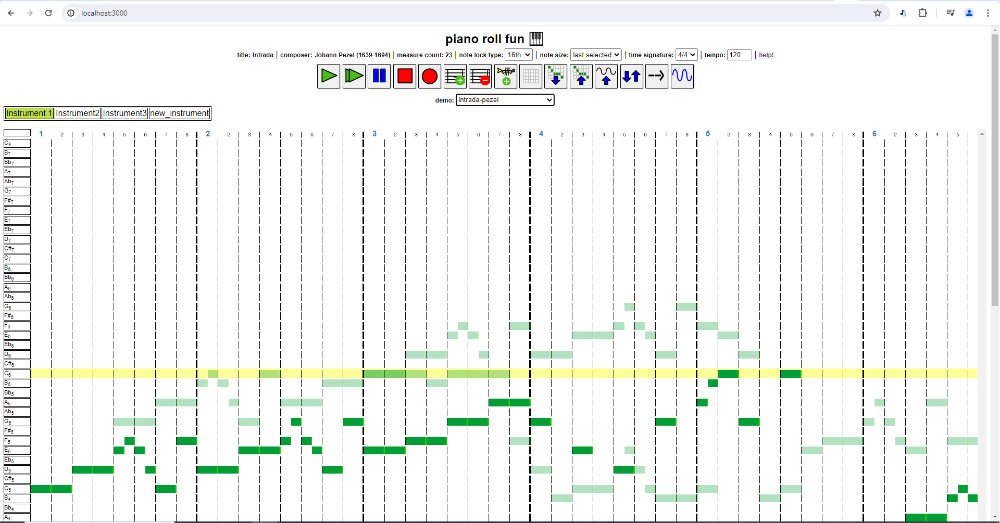
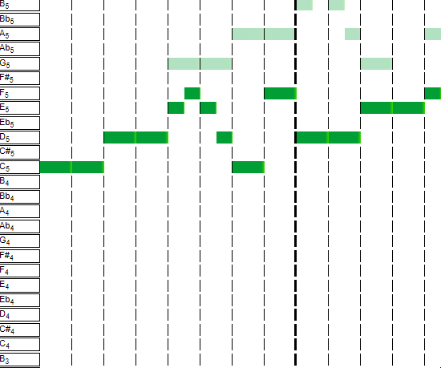
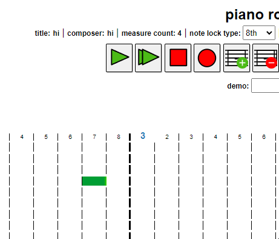

# piano_roll_browser    
a music sequencer inspired by LMMS, one of the best software applications ever!    
also influenced a bit by PxTone Collage, another great application!      
**it is highly recommended that Chrome be used for this application for proper functionality at the moment.**    
    
This project is a work-in-progress        
    
    
    
### cool features:    
- saveable projects    
- can click-and-drag to move and resize notes   
- each note is customizable    
- togglable onion skin    
- recordable    
     
### instructions:    
- To change the name of the piece or the composer, double click on 'title' or 'composer', just above the buttons.     

- Left-click a block on the grid to place a note; right-click to open a context menu to delete or use the middle mouse button. Stretch or shorten notes by grabbing the right side of a note and dragging. Notes can also be moved. Form chords by placing multiple notes in a column!    
    
Note context-menu on right-click:    
   
    
Resizing notes:    
    
    
- change the note lock type to adjust the range of note sizes and positions!    
    
Changing note lock size:    
    

- **want to add custom instrument presets?** use this other tool (https://syncopika.github.io/soundmaker/), download your preset, and import it in the piano roll! see the demo_presets folder for examples. Currently the kind of presets I support is extremely basic (just 2 kinds of nodes with limited customizations) but I plan to make more improvements in the future.    
	
check out a demo! see the demo dropdown box.    
    
### current issues:    
- non-functional currently on Edge and doesn't work quite well on Firefox (especially with percussion and custom presets). requires further debugging.    
- downloading the audio isn't great on Chrome - the audio duration is messed up (see: https://stackoverflow.com/questions/38443084/how-can-i-add-predefined-length-to-audio-recorded-from-mediarecorder-in-chrome).    
    
### current next steps?:    
- still need to delete instruments.    
    
### features I would like to implement:    
- ability to change color of highlight and color of note blocks, i.e. different for each instrument    
- be able to repeat a section 
    
### implementation / design:    
The objective of my piano roll, at least conceptually, is fairly straightforward. The goal is to arrange a number of notes with
varying lengths and pitches with the help of a grid, put these notes in an array and then create OscillatorNodes for each note so that a musical phrase can be played back.    
    
My implementation does not use the canvas element like some other piano roll implementations and instead relies on just DOM manipulation of a grid to manipulate notes.
Users can place and move notes freely on the piano roll. In order to do that, my program looks at a couple of factors: the location of the cursor and the note lock size, which can be an 8th note (1 block on the piano roll), 16th note (half a block), or 32nd note. The note lock size determines the incremental distance a note block can be moved. The smaller the note, the more possible locations within a piano roll block it could be placed. For note movement, the cursor's location is taken into account and if it is over a piano roll block, my program determines, based on the cursor's x-position, what position within the piano roll block the cursor is closest to and places the note at that position.    
    
For the context menus used to edit instruments and notes, I used the awesome jQuery contextMenu library provided here: https://swisnl.github.io/jQuery-contextMenu/. Thanks very much to them.
    
### demos:    
Intrada - Johann Pezel (1639 - 1694). One of my favorite brass quintet pieces!    
    
Sand Canyon (Kirby's Dream Land 3) - Jun Ishikawa
    
3_4 time demo - my own composition

    

